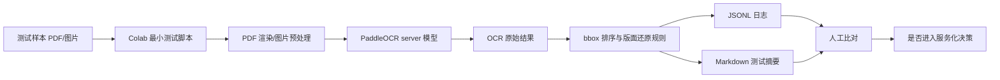
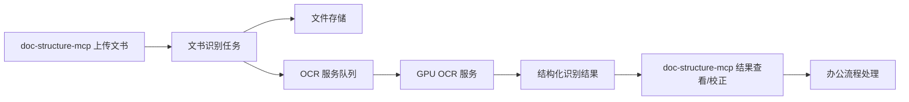
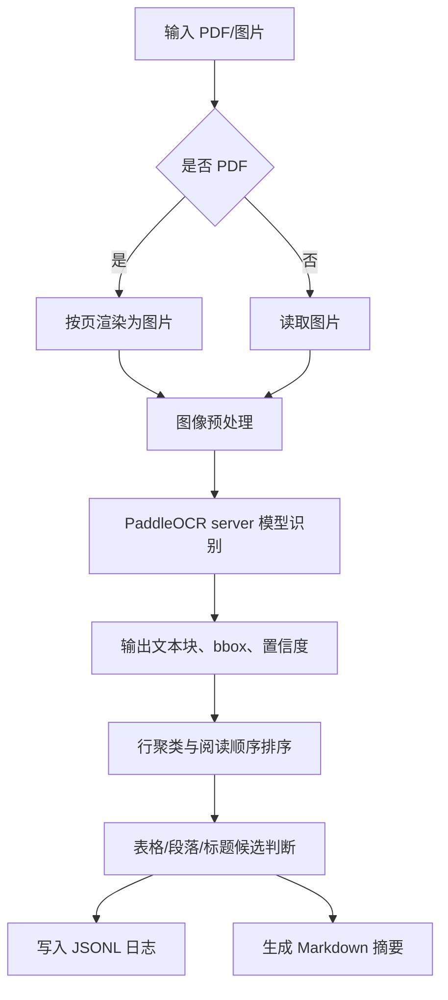

# 扫描件 PDF 文书 OCR 技术方案

## 1. 文档控制

| 项目 | 内容 |
|---|---|
| 文档名称 | 技术方案 |
| 文档性质 | 扫描件 PDF 与通用文书 OCR 研究阶段主方案，合并原项目设计文档内容 |
| 适用项目 | `doc-structure-mcp` 扫描型 PDF 到结构化 DOCX 识别还原项目 |
| 当前阶段 | 实验研究阶段 |
| 当前版本 | V0.2 |
| 最新更新 | 2026-07-30 |

## 2. 背景与任务目标

`doc-structure-mcp` 当前目标是将扫描型 PDF 识别并还原为结构化 DOCX。项目已有 PaddleOCR mobile、本地测试脚本、Flask 服务、`docx_builder.py` 排版还原和 Colab 优先验证流程。

下一步研究方向是面向更通用的办公文书：

- 扫描件 PDF。
- 图片化文档。
- 审批表、登记表、清单类表格。
- 合同、通知、证明、制度、报告等多页材料。

当前目标不是立即做成正式服务，而是研究“稍大的 OCR/server 模型”对扫描件 PDF、图片化文书、表格文书和多页材料的识别与版面还原能力。最终希望把纸质或图片化文书识别成后续办公处理可用的结构化内容，例如可搜索文本、可复制段落、可恢复表格、可生成 Word 或进入流程表单。

第一阶段只做最小化快速验证：

- 在本地无显卡的条件下，优先使用 Google Colab 或临时云端 GPU 环境跑通 PaddleOCR server 模型。
- 编写一个简单 OCR 测试程序，输入扫描件 PDF 或图片，输出识别文本、bbox 坐标、阅读顺序和基础版面还原日志。
- 不急于改造成正式生产服务，不扩大现有 Flask 服务的业务边界。
- 通过日志和少量样本人工比对判断 OCR、box 和版面还原效果是否值得进入服务化阶段。

## 3. 当前阶段定位

本项目当前仍是实验研究项目，不是正式产品化开发。

当前阶段只解决三个问题：

1. 稍大的 OCR/server 模型能否明显提升扫描件 PDF 的文字识别质量。
2. 模型输出的 bbox 是否足以支撑阅读顺序和版面还原。
3. 识别结果是否值得进一步做成 GPU 服务器上的 OCR 服务。

当前阶段不做：

- 不急于扩展正式上传流程。
- 不引入与扫描件结构还原无关的业务流程。
- 不做完整前端页面。
- 不承诺自动还原 Word 的最终效果。
- 不处理正式生产并发、权限、审计、归档。

## 4. 资料性质与边界

本阶段资料分为三类，不能混用：

| 类型 | 用途 | 管理要求 |
|---|---|---|
| 测试样本 | 扫描件 PDF、图片化文书、表格、盖章件等 | 真实材料只本地或授权云端测试，不进入版本库 |
| 测试日志 | 记录模型、参数、耗时、文本、bbox、还原结论 | 可以脱敏后入库或提交文档 |
| 技术方案资料 | 记录路线、边界、架构、接口候选、数据结构、风险 | 不等同于正式开发合同交付文档 |

## 5. 关键假设与不确定点

### 5.1 关键假设

- 当前本地机器没有可用 GPU，不能作为 PaddleOCR server 模型的主要验证环境。
- Google Colab 或同类临时 GPU 环境仅用于实验，不承载长期服务。
- 第一阶段重点是“看清模型能力”，不是追求完整工程化。
- 文书 OCR 的难点不只是文字识别，还包括阅读顺序、段落合并、表格结构、印章/手写/噪声、跨页连续性和可编辑文档还原。
- PaddleOCR server 模型主要提升文字检测和识别能力，不等同于多模态大模型的文档理解能力。

### 5.2 不确定点

- Colab 免费/付费 GPU 资源、运行时长和网络可用性不稳定。
- PaddleOCR server 模型对不同扫描质量、分辨率、倾斜、复印件和印章遮挡的效果差异较大。
- bbox 能否稳定还原表格结构，需要样本驱动验证。
- 后续是否需要引入 PP-Structure、表格识别模型、版面分析模型或 VLM，需要基于测试日志决策。
- 涉密、政务、合同、财务类文书是否允许上传到云端测试，需要逐项确认。

## 6. 总体架构

### 6.1 实验阶段架构



### 6.2 服务化候选架构



服务化阶段的核心原则：

- OCR 推理服务独立部署。
- `doc-structure-mcp` 负责上传入口、任务状态、结果查看、DOCX 生成和人工校正入口。
- 多页、大文件、耗时任务走异步队列。
- 原始文件、渲染图片、OCR JSON 和人工校正结果分层保存。

## 7. 技术路线

### 7.1 阶段一：最小测试程序

目标是跑通模型并产生可判断的日志。

输入：

- 单页图片：PNG、JPG。
- 扫描件 PDF：先转成图片，再逐页 OCR。
- 多页 PDF：逐页处理，保留页码。

输出：

- 原始 OCR 文本。
- 每个文本块的 bbox 坐标、置信度、页码。
- 按坐标排序后的阅读顺序。
- 按行合并后的文本。
- 表格候选区、左右栏候选区、标题/正文候选判断。
- JSON 日志和 Markdown 摘要。

推荐先实现为独立脚本，不接入 Spring Boot：

```text
scan_pdf_ocr_lab/
  samples/
  outputs/
  run_ocr.py
  layout_restore.py
  requirements.txt
  README.md
```

### 7.2 阶段二：效果评估

用 10-30 个典型样本做人工比对，重点看：

- 文字漏识别、错识别情况。
- bbox 是否贴合文字块。
- 同一行是否被拆碎。
- 多栏文档阅读顺序是否错乱。
- 表格行列是否能恢复。
- PDF 页码、段落、标题层级是否可用。
- 输出是否足以支撑后续办公处理，例如复制、搜索、归档、填表或生成 Word。

### 7.3 阶段三：服务化预研

只有当 OCR 与 bbox 还原效果满足要求后，才进入服务化设计：

- 独立部署 OCR 服务到有 GPU 的服务器。
- `doc-structure-mcp` 通过 HTTP 调用独立 OCR 服务。
- 增加任务队列、文件存储、状态轮询、日志留存和人工校正入口。
- 对文书识别结果建立统一结构：页、块、行、词、表格、段落、字段。

## 8. 推荐模型与组件

第一阶段优先验证：

| 能力 | 推荐组件 | 说明 |
|---|---|---|
| PDF 转图片 | `pypdfium2` 或 `PyMuPDF` | 先统一渲染到 200-300 DPI |
| OCR 检测识别 | PaddleOCR server 模型 | 重点看中文扫描件和 bbox |
| 基础版面排序 | 自研轻量规则 | 先按页、y 坐标、x 坐标、行高聚类 |
| 表格候选 | bbox 网格聚类 | 第一阶段只做日志判断，不急于完美还原 |
| 日志输出 | JSONL + Markdown | 便于快速对比和人工复盘 |

暂不优先引入复杂框架。若 PaddleOCR server 模型效果不足，再比较：

- PP-Structure / PaddleX 文档结构化能力。
- 云端 OCR 或大模型 OCR。
- 本地 VLM 对疑难样本的结构化补充能力。

## 9. 模块设计

### 9.1 实验脚本模块

| 模块 | 职责 |
|---|---|
| 输入管理 | 读取 PDF/图片，生成样本编号 |
| PDF 渲染 | 将 PDF 按页渲染为图片 |
| 图像预处理 | 可选做旋转、裁边、灰度、增强 |
| OCR 调用 | 调用 PaddleOCR server 模型 |
| 结果标准化 | 统一文本块、bbox、置信度、页码 |
| 版面还原 | 行聚类、块排序、表格候选判断 |
| 日志输出 | 输出 JSONL、Markdown、耗时统计 |

### 9.2 结果数据结构

实验阶段建议统一为以下结构：

```json
{
  "document_id": "sample-001",
  "file_name": "sample.pdf",
  "page_count": 2,
  "model": "paddleocr-server",
  "pages": [
    {
      "page_no": 1,
      "width": 2480,
      "height": 3508,
      "duration_ms": 1200,
      "blocks": [
        {
          "text": "示例文本",
          "bbox": [[100, 120], [300, 120], [300, 160], [100, 160]],
          "confidence": 0.98,
          "line_no": 1,
          "order": 1
        }
      ],
      "plain_text": "按阅读顺序合并后的文本"
    }
  ]
}
```

### 9.3 识别结果分层

为了服务后续办公处理，结果不要只保存一段纯文本，应分层保存：

| 层级 | 内容 | 用途 |
|---|---|---|
| Document | 文件名、页数、模型、总耗时 | 任务追踪 |
| Page | 页码、尺寸、渲染 DPI、页耗时 | 多页定位 |
| Block | 文本块、bbox、置信度 | 版面还原 |
| Line | 行文本、行 bbox、排序 | 可读文本 |
| Table | 表格候选、行列关系 | 表格恢复 |
| Field | 业务字段候选 | 后续流程表单 |

## 10. 最小程序处理流程



## 11. 日志判断与验证标准

第一阶段不追求自动评分完全准确，先采用人工验收标准：

| 维度 | 可接受标准 |
|---|---|
| 文本识别 | 关键正文、标题、编号、金额、日期等主要文字可读 |
| bbox | 文字块坐标基本贴合，不大面积漂移 |
| 阅读顺序 | 单栏文档基本正确，多栏文档错误可定位 |
| 表格 | 能看出行列关系，至少不会完全串行混乱 |
| 多页 | 页码清楚，单页失败不影响其他页日志 |
| 性能 | 单页耗时、总耗时可记录，可横向比较模型 |

实验阶段完成标准：

- 能在 Google Colab 跑通最小 OCR 程序。
- 能处理至少一种扫描件 PDF 和一种图片文书。
- 能输出逐页 JSONL 和 Markdown 日志。
- 日志包含文本、bbox、置信度、耗时和排序结果。
- 能通过 10 个以上样本判断 server 模型是否优于当前 mobile 模型。

进入服务化阶段的建议标准：

- 普通扫描件正文识别可用。
- 表格文书行列关系基本可恢复。
- bbox 对齐质量足以支撑人工校正界面。
- 多页 PDF 处理稳定，失败可定位、可重试。
- GPU 环境中的平均耗时可接受。

## 12. 后续服务化方向

服务化阶段建议采用独立 OCR 服务，不直接把重模型塞进当前 Flask 文档服务：

- `doc-structure-mcp` 负责上传、任务管理、结构化结果展示、DOCX 生成和人工校正。
- OCR 服务负责 PDF 渲染、模型推理、bbox 还原和结构化输出。
- GPU 服务器只部署 OCR 推理服务，避免和业务系统混布。
- 大文件、多页文件走异步任务，前端轮询或消息通知。

服务化时再考虑加入以下接口，实验阶段不实现：

| 方法 | 路径 | 说明 |
|---|---|---|
| POST | `/document-ocr/tasks` | 创建文书 OCR 任务 |
| GET | `/document-ocr/tasks/{id}` | 查询任务状态 |
| GET | `/document-ocr/tasks/{id}/result` | 查询结构化结果 |
| POST | `/document-ocr/tasks/{id}/retry` | 失败任务重试 |
| PUT | `/document-ocr/tasks/{id}/correction` | 保存人工校正结果 |

## 13. 风险与应对

| 风险 | 表现 | 应对 |
|---|---|---|
| 云端测试合规风险 | 真实材料不允许上传 | 只用脱敏样本或公开样本 |
| Colab 环境不稳定 | 断连、显卡变化、安装失败 | 保留可复现脚本和依赖版本 |
| OCR 提升有限 | server 模型仍漏字错字 | 比较 PP-Structure、云 OCR 或 VLM |
| bbox 可用但表格差 | 文本能识别，行列还原差 | 单独研究表格结构模型 |
| 服务化成本高 | GPU 资源贵、并发低 | 异步队列、限流、任务优先级 |
| 结果难以直接办公 | 纯文本不能恢复格式 | 增加人工校正和 Word 还原实验 |

## 14. 里程碑

| 里程碑 | 目标 | 输出物 |
|---|---|---|
| M1 最小跑通 | Colab 跑通单图 OCR | 脚本、首份日志 |
| M2 PDF 跑通 | 支持 PDF 按页渲染 OCR | JSONL、Markdown 摘要 |
| M3 bbox 评估 | 判断阅读顺序和表格候选 | 模型测试日志 |
| M4 模型取舍 | 决定是否进入服务化 | 技术结论 |
| M5 服务化预研 | 设计 GPU OCR 服务 | 接口和部署草案 |

## 15. 单样本验证流程

第一轮先测 `tests/fixtures/test_page1.png`，它是红头文件样本，更能暴露竖排/红头/阅读顺序问题。第二轮再用同一流程测 `tests/fixtures/test_page2.pdf`，用于观察 PDF 渲染、发票/表格类版面的 OCR 和 bbox 情况。

### 15.1 发布到 Google Colab 的内容

第一轮上传两个文件到 Colab 当前目录：

```text
tests/fixtures/test_page1.png
tests/colab_single_sample_ocr.py
```

如果使用笔记本方式，直接上传并打开：

```text
docs/single_sample_ocr_lab.ipynb
```

运行到“上传一个测试文件”的单元格时，再上传 `test_page1.png`。笔记本会自动完成 OCR、bbox 可视化、排序文本、评价报告和 zip 下载。

如果 Colab 报 `libcuda.so.1` 缺失，说明当前会话没有真正分配 GPU，却安装了 GPU 版 Paddle。处理方式是：断开并删除当前会话，重新打开新版笔记本；新版第一格会先检测 `nvidia-smi`，没有 GPU 时自动安装 CPU 版。

在 Colab 执行：

```bash
!pip uninstall -y paddlepaddle paddlepaddle-gpu paddleocr paddlex
!python -m pip install -q paddlepaddle-gpu==3.2.0 -i https://www.paddlepaddle.org.cn/packages/stable/cu126/
!pip install -q paddleocr==3.6.0 pymupdf opencv-python-headless pillow
!python colab_single_sample_ocr.py --input test_page1.png --case red_header_v1
```

第二轮测 PDF 时上传：

```text
tests/fixtures/test_page2.pdf
tests/colab_single_sample_ocr.py
```

执行：

```bash
!pip uninstall -y paddlepaddle paddlepaddle-gpu paddleocr paddlex
!python -m pip install -q paddlepaddle-gpu==3.2.0 -i https://www.paddlepaddle.org.cn/packages/stable/cu126/
!pip install -q paddleocr==3.6.0 pymupdf opencv-python-headless pillow
!python colab_single_sample_ocr.py --input test_page2.pdf --case invoice_pdf_v1
```

默认模型组合：

```text
det = PP-OCRv5_server_det
rec = PP-OCRv5_server_rec
dpi = 220
```

如果要对比 mobile 模型，只改参数，不改流程：

```bash
!python colab_single_sample_ocr.py --input test_page1.png --case red_header_mobile_v1 --det PP-OCRv5_mobile_det --rec PP-OCRv5_mobile_rec
```

### 15.2 从 Colab 拷贝回来的内容

Colab 执行完成后下载：

```text
/content/ocr_lab_outputs/red_header_v1.zip
```

解压到本地：

```text
tests/output/ocr_lab/red_header_v1/
```

目录里应至少包含：

```text
ocr_result.json       # 原始 OCR + bbox + confidence + page 信息
ocr_result.md         # Colab 侧摘要
page_001.png          # PDF 渲染页图或原始图片副本
```

第二轮 PDF 样本同理，建议解压到：

```text
tests/output/ocr_lab/invoice_pdf_v1/
```

### 15.3 本地脚本配合执行

本地执行评价脚本：

```bash
python scripts/evaluate_ocr_lab_result.py ^
  --result tests/output/ocr_lab/red_header_v1/ocr_result.json ^
  --out tests/output/ocr_lab/red_header_v1_local
```

输出：

```text
tests/output/ocr_lab/red_header_v1_local/evaluation.md
tests/output/ocr_lab/red_header_v1_local/evaluation.json
tests/output/ocr_lab/red_header_v1_local/page_001_sorted.txt
tests/output/ocr_lab/red_header_v1_local/page_001_boxes.png
```

其中：

- `page_001_boxes.png`：把 bbox 画回页面，用来判断检测框是否准。
- `page_001_sorted.txt`：按 bbox 聚类排序后的文本，用来判断阅读顺序。
- `evaluation.md`：自动统计行数、平均置信度、低置信度数量、竖高框数量和警告。
- `evaluation.json`：后续脚本可继续消费的结构化评价结果。

### 15.4 对执行结果作何评价

每一轮都按四个层次评价：

| 层次 | 看什么 | 结论含义 |
|---|---|---|
| OCR 文本 | 是否漏字、错字、重复字，关键标题/编号/日期是否可读 | 判断识别模型能力 |
| bbox 检测 | 框是否贴合文字，是否漏框、粘框、碎框 | 判断检测模型能力 |
| 阅读顺序 | `page_001_sorted.txt` 是否接近人眼阅读顺序 | 判断后处理是否可行 |
| 可还原性 | 是否足以生成可编辑 DOCX 草稿 | 判断是否进入服务化 |

自动评分只做辅助：

| 分级 | 含义 |
|---|---|
| A | 文本和 bbox 基本可用，可以继续服务化实验 |
| B | 主体可用，但要人工检查排序文本和框图 |
| C | 只能作为参考文本，需要换模型、DPI、预处理或版面规则 |
| D | 当前模型/参数不可用 |

人工最终结论必须写回 `docs/模型测试日志.md`，至少记录：

```text
测试编号、样本、模型、DPI、耗时、自动评分、人工结论、下一步动作。
```

### 15.5 推动迭代的规则

每次只改一个变量：

- 先固定样本 `test_page1.png`，对比 server 与 mobile。
- 如果 server 明显好，再调 DPI：200、220、300。
- 如果 bbox 准但排序差，改本地排序/版面还原脚本。
- 如果字错多但 bbox 准，换识别模型。
- 如果漏框多或红头竖排识别差，换检测模型或增加预处理。
- 单个样本结论稳定后，再切换 `test_page2.pdf`，不要两个样本同时混测。

## 16. 与现有项目的关系

本研究项目可以复用此前 OCR 项目的经验，同时以 `doc-structure-mcp` 的文书还原目标为主：

- OCR 引擎配置和模型切换的管理思想。
- bbox 区域解析和阅读顺序恢复经验。
- 文件上传、状态记录和 OCR 原始 JSON 留存思路。
- “识别结果必须可追溯、可人工确认”的原则。

第一阶段优先在 `doc-structure-mcp` 的 `tests/`、`docs/` 和独立实验脚本中验证。等模型效果确认后，再决定是否扩展当前 Flask 服务或拆出 GPU OCR 服务。

## 17. 当前取舍

当前选择“Colab 最小脚本 + 日志判断 + 样本驱动”的原因：

- 本地没有显卡，先做本地工程化会被硬件条件拖慢。
- 扫描件文书的关键风险在识别效果和版面还原，不在后台增删改查。
- 只有模型效果成立，后续服务化、队列化、界面化才有投入价值。
- 可以快速比较 mobile/server/结构化模型的真实差异，避免凭感觉选型。

## 18. 2026-07-30 实验代码与输出关系记录

### 18.1 今日形成的判断

本轮实验确认：第一阶段不应直接用 DOCX 作为版面还原质量的主要判断依据。

原因是 DOCX 是流式文档格式，普通段落和 Word 表格都不是像素画布。若用表格网格模拟 bbox 坐标，容易出现分页、行高、内边距、字体重绘导致的版面失真。此前 `honest_docx_preview` 能证明 bbox 大体位置，但视觉还原价值有限，不能作为主要评价产物。

当前采用两个分工明确的输出：

| 输出 | 作用 | 评价重点 |
|---|---|---|
| `*_overlay.html` | 以原始页面图为背景，按 OCR bbox 绝对定位覆盖文本框 | 判断 OCR bbox、阅读方向、块位置是否可信 |
| `*_plain.docx` | 按行聚类输出普通可编辑文本 | 判断 OCR 文本是否适合后续办公编辑 |

因此当前评价顺序调整为：

1. 先看 `*_overlay.html`，确认 bbox 是否罩住原文、是否漏框、是否粘框、竖排是否可判断。
2. 再看 `*_plain.docx`，确认文字是否可复制、行顺序是否大体可读。
3. 暂不把 DOCX 视觉效果作为第一阶段成功标准。

### 18.2 Colab 输出与本地代码的关系

Colab 笔记本 `docs/single_sample_ocr_lab.ipynb` 负责在 GPU 环境运行 PaddleOCR 三组模型，并输出三套原始结果：

```text
<case>/
  mobile/
    ocr_result.json
    page_001.png
    page_001_boxes.png
    page_001_sorted.txt
    evaluation.md
    evaluation.json
  mid/
    ...
  server/
    ...
  model_compare.md
  model_compare.json
```

本地新增的通用预览代码只消费 Colab 下载回来的 `ocr_result.json` 和对应页面图，不重新 OCR：

| 本地文件 | 职责 |
|---|---|
| `src/layout_preview.py` | 从 OCR JSON 生成 HTML bbox 覆盖图和 plain DOCX 文本稿 |
| `scripts/generate_layout_previews.py` | 对 `mobile`、`mid`、`server` 三个目录批量生成本地预览 |
| `tests/test_layout_preview.py` | 验证 overlay 绝对定位、竖排判断和 plain DOCX 行分离 |

执行方式：

```powershell
python scripts/generate_layout_previews.py "tests/testContent/test_page2_three_models_unzipped/test_page2_1_three_models_v1"
```

生成结果：

```text
tests/testContent/test_page2_three_models_unzipped/test_page2_1_three_models_v1/layout_preview_v2/
  mobile_overlay.html
  mobile_plain.docx
  mid_overlay.html
  mid_plain.docx
  server_overlay.html
  server_plain.docx
```

若某个 DOCX 正被 Word 或 WPS 打开，脚本会改写为 `*_plain_new.docx`，避免整个批处理失败。

### 18.3 三模型命名关系

当前三组模型用于比较检测模型和识别模型对结果的影响：

| 名称 | 检测模型 | 识别模型 | 目的 |
|---|---|---|---|
| `mobile` | `PP-OCRv5_mobile_det` | `PP-OCRv5_mobile_rec` | 作为轻量模型基线 |
| `mid` | `PP-OCRv5_server_det` | `PP-OCRv5_mobile_rec` | 单独观察 server 检测模型对 bbox 的提升 |
| `server` | `PP-OCRv5_server_det` | `PP-OCRv5_server_rec` | 观察检测和识别都使用 server 的完整效果 |

本轮发票样本观察中，`server` 的文字识别整体最好，`mid` 速度较快且 bbox 表现接近 `server`，`mobile` 有更多碎框和噪声。当前暂不引入 PaddleX 3.7.2 的 PP-OCRv6 medium 技术线，避免不同技术线混入同一轮结论。

### 18.4 竖排还原规则

三种模型对“购买方信息”“销售方信息”“备注”均能识别出正确文字，并返回高窄 bbox。例如：

```text
购买方信息：宽约 48px，高约 188px，h/w 约 3.9
销售方信息：宽约 41px，高约 188px，h/w 约 4.6
备注：宽约 47px，高约 98px，h/w 约 2.1
```

OCR 结果没有显式返回 `direction=vertical`，因此本地 overlay 采用通用规则判断竖排：

- 文本长度 2 到 8。
- 中文字符占比不低于 75%。
- bbox 高宽比 `h/w >= 1.8`。

命中后在 HTML 中使用：

```css
writing-mode: vertical-rl;
text-orientation: upright;
```

该规则是通用版面规则，不针对发票字段硬编码。它适用于短中文竖排标签，但仍需注意：长段落、旋转文本、印章文字、表格线附近噪声可能需要后续更细规则。

### 18.5 坐标看起来不完全贴合的原因

当前 overlay 中有些框看起来比原字高或低，主要原因如下：

- PaddleOCR 返回的是文本检测框，不是每个字符的精确外轮廓。
- 检测框为了覆盖完整文字，通常带有上下左右余量。
- OCR 返回四点框，本地 HTML 当前用外接矩形绝对定位，旋转或倾斜时会显得偏大。
- Colab 中 PDF 先渲染成图片，bbox 坐标对应的是渲染图像坐标，不是 PDF 原生矢量坐标。
- HTML 中覆盖的文字是浏览器重新绘制的字体，不能与底图原字逐像素重合。

因此第一阶段应重点看“bbox 是否覆盖原文区域、是否漏框、是否粘框、阅读顺序是否可恢复”，不要要求 overlay 重绘文字与原图文字完全贴合。

### 18.6 后续方向

下一轮优先补充以下通用能力：

- overlay 增加“只显示 bbox / 显示 OCR 文字 / 显示置信度”的开关。
- 对四点 bbox 直接画多边形，而不是只画外接矩形。
- 增加行、列、表格线的可视化辅助层。
- 用 `test_page1.png` 红头文件复测竖排、标题、正文阅读顺序。
- 积累至少 10 个样本后，再决定是否进入 GPU 服务化。


