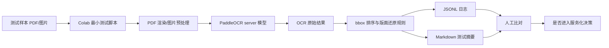
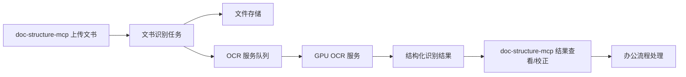
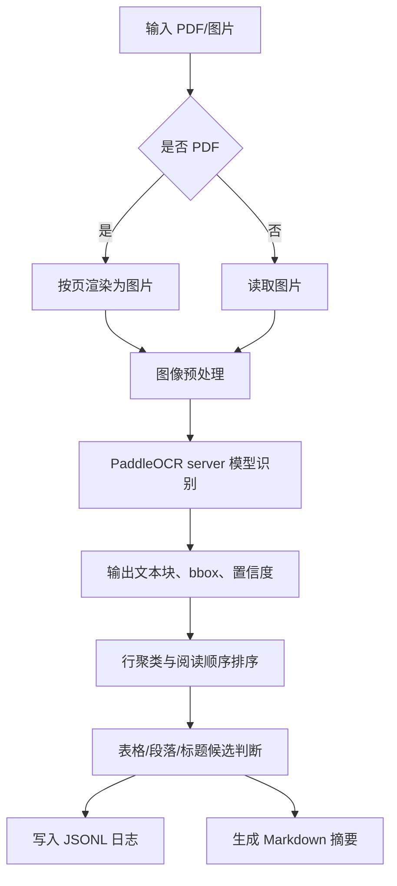
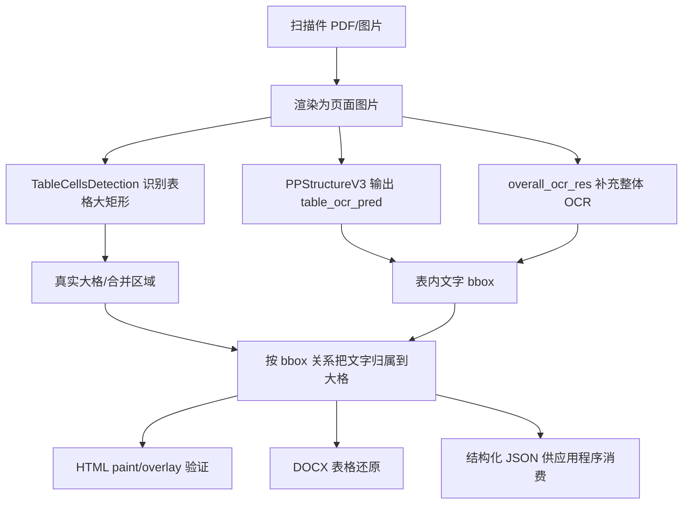

# 扫描件 PDF 文书 OCR 技术方案

## 1. 文档控制

| 项目 | 内容 |
|---|---|
| 文档名称 | 技术方案 |
| 文档性质 | 扫描件 PDF 与通用文书 OCR 研究阶段主方案，合并原项目设计文档内容 |
| 适用项目 | `doc-structure-mcp` 扫描型 PDF 到结构化 DOCX 识别还原项目 |
| 当前阶段 | 实验研究阶段 |
| 当前版本 | V0.3 |
| 最新更新 | 2026-07-31 |

## 2. 背景与任务目标

`doc-structure-mcp` 当前目标是将扫描型 PDF 识别并还原为结构化 DOCX。项目已有 PaddleOCR mobile、本地测试脚本、Flask 服务、`docx_builder.py` 排版还原和 Colab 优先验证流程。

下一步研究方向是面向更通用的办公文书：

- 扫描件 PDF。
- 图片化文档。
- 审批表、登记表、清单类表格。
- 合同、通知、证明、制度、报告等多页材料。

当前目标不是立即做成正式服务，而是研究“稍大的 OCR/server 模型”对扫描件 PDF、图片化文书、表格文书和多页材料的识别与版面还原能力。最终希望把纸质或图片化文书识别成后续办公处理可用的结构化内容，例如可搜索文本、可复制段落、可恢复表格、可生成 Word 或进入流程表单。

第一阶段只做最小化快速验证：

- 在本地无显卡的条件下，优先使用 Google Colab 或临时云端 GPU 环境跑通 PaddleOCR server 模型。
- 编写一个简单 OCR 测试程序，输入扫描件 PDF 或图片，输出识别文本、bbox 坐标、阅读顺序和基础版面还原日志。
- 不急于改造成正式生产服务，不扩大现有 Flask 服务的业务边界。
- 通过日志和少量样本人工比对判断 OCR、box 和版面还原效果是否值得进入服务化阶段。

## 3. 当前阶段定位

本项目当前仍是实验研究项目，不是正式产品化开发。

当前阶段只解决三个问题：

1. 稍大的 OCR/server 模型能否明显提升扫描件 PDF 的文字识别质量。
2. 模型输出的 bbox 是否足以支撑阅读顺序和版面还原。
3. 识别结果是否值得进一步做成 GPU 服务器上的 OCR 服务。

当前阶段不做：

- 不急于扩展正式上传流程。
- 不引入与扫描件结构还原无关的业务流程。
- 不做完整前端页面。
- 不承诺自动还原 Word 的最终效果。
- 不处理正式生产并发、权限、审计、归档。

## 4. 资料性质与边界

本阶段资料分为三类，不能混用：

| 类型 | 用途 | 管理要求 |
|---|---|---|
| 测试样本 | 扫描件 PDF、图片化文书、表格、盖章件等 | 真实材料只本地或授权云端测试，不进入版本库 |
| 测试日志 | 记录模型、参数、耗时、文本、bbox、还原结论 | 可以脱敏后入库或提交文档 |
| 技术方案资料 | 记录路线、边界、架构、接口候选、数据结构、风险 | 不等同于正式开发合同交付文档 |

## 5. 关键假设与不确定点

### 5.1 关键假设

- 当前本地机器没有可用 GPU，不能作为 PaddleOCR server 模型的主要验证环境。
- Google Colab 或同类临时 GPU 环境仅用于实验，不承载长期服务。
- 第一阶段重点是“看清模型能力”，不是追求完整工程化。
- 文书 OCR 的难点不只是文字识别，还包括阅读顺序、段落合并、表格结构、印章/手写/噪声、跨页连续性和可编辑文档还原。
- PaddleOCR server 模型主要提升文字检测和识别能力，不等同于多模态大模型的文档理解能力。

### 5.2 不确定点

- Colab 免费/付费 GPU 资源、运行时长和网络可用性不稳定。
- PaddleOCR server 模型对不同扫描质量、分辨率、倾斜、复印件和印章遮挡的效果差异较大。
- bbox 能否稳定还原表格结构，需要样本驱动验证。
- 后续是否需要引入 PP-Structure、表格识别模型、版面分析模型或 VLM，需要基于测试日志决策。
- 涉密、政务、合同、财务类文书是否允许上传到云端测试，需要逐项确认。

## 6. 总体架构

### 6.1 实验阶段架构



### 6.2 服务化候选架构



服务化阶段的核心原则：

- OCR 推理服务独立部署。
- `doc-structure-mcp` 负责上传入口、任务状态、结果查看、DOCX 生成和人工校正入口。
- 多页、大文件、耗时任务走异步队列。
- 原始文件、渲染图片、OCR JSON 和人工校正结果分层保存。

## 7. 技术路线

### 7.1 阶段一：最小测试程序

目标是跑通模型并产生可判断的日志。

输入：

- 单页图片：PNG、JPG。
- 扫描件 PDF：先转成图片，再逐页 OCR。
- 多页 PDF：逐页处理，保留页码。

输出：

- 原始 OCR 文本。
- 每个文本块的 bbox 坐标、置信度、页码。
- 按坐标排序后的阅读顺序。
- 按行合并后的文本。
- 表格候选区、左右栏候选区、标题/正文候选判断。
- JSON 日志和 Markdown 摘要。

推荐先实现为独立脚本，不接入 Spring Boot：

```text
scan_pdf_ocr_lab/
  samples/
  outputs/
  run_ocr.py
  layout_restore.py
  requirements.txt
  README.md
```

### 7.2 阶段二：效果评估

用 10-30 个典型样本做人工比对，重点看：

- 文字漏识别、错识别情况。
- bbox 是否贴合文字块。
- 同一行是否被拆碎。
- 多栏文档阅读顺序是否错乱。
- 表格行列是否能恢复。
- PDF 页码、段落、标题层级是否可用。
- 输出是否足以支撑后续办公处理，例如复制、搜索、归档、填表或生成 Word。

### 7.3 阶段三：服务化预研

只有当 OCR 与 bbox 还原效果满足要求后，才进入服务化设计：

- 独立部署 OCR 服务到有 GPU 的服务器。
- `doc-structure-mcp` 通过 HTTP 调用独立 OCR 服务。
- 增加任务队列、文件存储、状态轮询、日志留存和人工校正入口。
- 对文书识别结果建立统一结构：页、块、行、词、表格、段落、字段。

## 8. 推荐模型与组件

第一阶段优先验证：

| 能力 | 推荐组件 | 说明 |
|---|---|---|
| PDF 转图片 | `pypdfium2` 或 `PyMuPDF` | 先统一渲染到 200-300 DPI |
| OCR 检测识别 | PaddleOCR server 模型 | 重点看中文扫描件和 bbox |
| 基础版面排序 | 自研轻量规则 | 先按页、y 坐标、x 坐标、行高聚类 |
| 表格候选 | bbox 网格聚类 | 第一阶段只做日志判断，不急于完美还原 |
| 日志输出 | JSONL + Markdown | 便于快速对比和人工复盘 |

暂不优先引入复杂框架。若 PaddleOCR server 模型效果不足，再比较：

- PP-Structure / PaddleX 文档结构化能力。
- 云端 OCR 或大模型 OCR。
- 本地 VLM 对疑难样本的结构化补充能力。

## 9. 模块设计

### 9.1 实验脚本模块

| 模块 | 职责 |
|---|---|
| 输入管理 | 读取 PDF/图片，生成样本编号 |
| PDF 渲染 | 将 PDF 按页渲染为图片 |
| 图像预处理 | 可选做旋转、裁边、灰度、增强 |
| OCR 调用 | 调用 PaddleOCR server 模型 |
| 结果标准化 | 统一文本块、bbox、置信度、页码 |
| 版面还原 | 行聚类、块排序、表格候选判断 |
| 日志输出 | 输出 JSONL、Markdown、耗时统计 |

### 9.2 结果数据结构

实验阶段建议统一为以下结构：

```json
{
  "document_id": "sample-001",
  "file_name": "sample.pdf",
  "page_count": 2,
  "model": "paddleocr-server",
  "pages": [
    {
      "page_no": 1,
      "width": 2480,
      "height": 3508,
      "duration_ms": 1200,
      "blocks": [
        {
          "text": "示例文本",
          "bbox": [[100, 120], [300, 120], [300, 160], [100, 160]],
          "confidence": 0.98,
          "line_no": 1,
          "order": 1
        }
      ],
      "plain_text": "按阅读顺序合并后的文本"
    }
  ]
}
```

### 9.3 识别结果分层

为了服务后续办公处理，结果不要只保存一段纯文本，应分层保存：

| 层级 | 内容 | 用途 |
|---|---|---|
| Document | 文件名、页数、模型、总耗时 | 任务追踪 |
| Page | 页码、尺寸、渲染 DPI、页耗时 | 多页定位 |
| Block | 文本块、bbox、置信度 | 版面还原 |
| Line | 行文本、行 bbox、排序 | 可读文本 |
| Table | 表格候选、行列关系 | 表格恢复 |
| Field | 业务字段候选 | 后续流程表单 |

## 10. 最小程序处理流程



## 11. 日志判断与验证标准

第一阶段不追求自动评分完全准确，先采用人工验收标准：

| 维度 | 可接受标准 |
|---|---|
| 文本识别 | 关键正文、标题、编号、金额、日期等主要文字可读 |
| bbox | 文字块坐标基本贴合，不大面积漂移 |
| 阅读顺序 | 单栏文档基本正确，多栏文档错误可定位 |
| 表格 | 能看出行列关系，至少不会完全串行混乱 |
| 多页 | 页码清楚，单页失败不影响其他页日志 |
| 性能 | 单页耗时、总耗时可记录，可横向比较模型 |

实验阶段完成标准：

- 能在 Google Colab 跑通最小 OCR 程序。
- 能处理至少一种扫描件 PDF 和一种图片文书。
- 能输出逐页 JSONL 和 Markdown 日志。
- 日志包含文本、bbox、置信度、耗时和排序结果。
- 能通过 10 个以上样本判断 server 模型是否优于当前 mobile 模型。

进入服务化阶段的建议标准：

- 普通扫描件正文识别可用。
- 表格文书行列关系基本可恢复。
- bbox 对齐质量足以支撑人工校正界面。
- 多页 PDF 处理稳定，失败可定位、可重试。
- GPU 环境中的平均耗时可接受。

## 12. 后续服务化方向

服务化阶段建议采用独立 OCR 服务，不直接把重模型塞进当前 Flask 文档服务：

- `doc-structure-mcp` 负责上传、任务管理、结构化结果展示、DOCX 生成和人工校正。
- OCR 服务负责 PDF 渲染、模型推理、bbox 还原和结构化输出。
- GPU 服务器只部署 OCR 推理服务，避免和业务系统混布。
- 大文件、多页文件走异步任务，前端轮询或消息通知。

服务化时再考虑加入以下接口，实验阶段不实现：

| 方法 | 路径 | 说明 |
|---|---|---|
| POST | `/document-ocr/tasks` | 创建文书 OCR 任务 |
| GET | `/document-ocr/tasks/{id}` | 查询任务状态 |
| GET | `/document-ocr/tasks/{id}/result` | 查询结构化结果 |
| POST | `/document-ocr/tasks/{id}/retry` | 失败任务重试 |
| PUT | `/document-ocr/tasks/{id}/correction` | 保存人工校正结果 |

## 13. 风险与应对

| 风险 | 表现 | 应对 |
|---|---|---|
| 云端测试合规风险 | 真实材料不允许上传 | 只用脱敏样本或公开样本 |
| Colab 环境不稳定 | 断连、显卡变化、安装失败 | 保留可复现脚本和依赖版本 |
| OCR 提升有限 | server 模型仍漏字错字 | 比较 PP-Structure、云 OCR 或 VLM |
| bbox 可用但表格差 | 文本能识别，行列还原差 | 单独研究表格结构模型 |
| 服务化成本高 | GPU 资源贵、并发低 | 异步队列、限流、任务优先级 |
| 结果难以直接办公 | 纯文本不能恢复格式 | 增加人工校正和 Word 还原实验 |

## 14. 里程碑

| 里程碑 | 目标 | 输出物 |
|---|---|---|
| M1 最小跑通 | Colab 跑通单图 OCR | 脚本、首份日志 |
| M2 PDF 跑通 | 支持 PDF 按页渲染 OCR | JSONL、Markdown 摘要 |
| M3 bbox 评估 | 判断阅读顺序和表格候选 | 模型测试日志 |
| M4 模型取舍 | 决定是否进入服务化 | 技术结论 |
| M5 服务化预研 | 设计 GPU OCR 服务 | 接口和部署草案 |

## 15. 单样本验证流程

第一轮先测 `tests/fixtures/test_page1.png`，它是红头文件样本，更能暴露竖排/红头/阅读顺序问题。第二轮再用同一流程测 `tests/fixtures/test_page2.pdf`，用于观察 PDF 渲染、发票/表格类版面的 OCR 和 bbox 情况。

### 15.1 发布到 Google Colab 的内容

第一轮上传两个文件到 Colab 当前目录：

```text
tests/fixtures/test_page1.png
tests/colab_single_sample_ocr.py
```

如果使用笔记本方式，直接上传并打开：

```text
docs/single_sample_ocr_lab.ipynb
```

运行到“上传一个测试文件”的单元格时，再上传 `test_page1.png`。笔记本会自动完成 OCR、bbox 可视化、排序文本、评价报告和 zip 下载。

如果 Colab 报 `libcuda.so.1` 缺失，说明当前会话没有真正分配 GPU，却安装了 GPU 版 Paddle。处理方式是：断开并删除当前会话，重新打开新版笔记本；新版第一格会先检测 `nvidia-smi`，没有 GPU 时自动安装 CPU 版。

在 Colab 执行：

```bash
!pip uninstall -y paddlepaddle paddlepaddle-gpu paddleocr paddlex
!python -m pip install -q paddlepaddle-gpu==3.2.0 -i https://www.paddlepaddle.org.cn/packages/stable/cu126/
!pip install -q paddleocr==3.6.0 pymupdf opencv-python-headless pillow
!python colab_single_sample_ocr.py --input test_page1.png --case red_header_v1
```

第二轮测 PDF 时上传：

```text
tests/fixtures/test_page2.pdf
tests/colab_single_sample_ocr.py
```

执行：

```bash
!pip uninstall -y paddlepaddle paddlepaddle-gpu paddleocr paddlex
!python -m pip install -q paddlepaddle-gpu==3.2.0 -i https://www.paddlepaddle.org.cn/packages/stable/cu126/
!pip install -q paddleocr==3.6.0 pymupdf opencv-python-headless pillow
!python colab_single_sample_ocr.py --input test_page2.pdf --case invoice_pdf_v1
```

默认模型组合：

```text
det = PP-OCRv5_server_det
rec = PP-OCRv5_server_rec
dpi = 220
```

如果要对比 mobile 模型，只改参数，不改流程：

```bash
!python colab_single_sample_ocr.py --input test_page1.png --case red_header_mobile_v1 --det PP-OCRv5_mobile_det --rec PP-OCRv5_mobile_rec
```

### 15.2 从 Colab 拷贝回来的内容

Colab 执行完成后下载：

```text
/content/ocr_lab_outputs/red_header_v1.zip
```

解压到本地：

```text
tests/output/ocr_lab/red_header_v1/
```

目录里应至少包含：

```text
ocr_result.json       # 原始 OCR + bbox + confidence + page 信息
ocr_result.md         # Colab 侧摘要
page_001.png          # PDF 渲染页图或原始图片副本
```

第二轮 PDF 样本同理，建议解压到：

```text
tests/output/ocr_lab/invoice_pdf_v1/
```

### 15.3 本地脚本配合执行

本地执行评价脚本：

```bash
python scripts/evaluate_ocr_lab_result.py ^
  --result tests/output/ocr_lab/red_header_v1/ocr_result.json ^
  --out tests/output/ocr_lab/red_header_v1_local
```

输出：

```text
tests/output/ocr_lab/red_header_v1_local/evaluation.md
tests/output/ocr_lab/red_header_v1_local/evaluation.json
tests/output/ocr_lab/red_header_v1_local/page_001_sorted.txt
tests/output/ocr_lab/red_header_v1_local/page_001_boxes.png
```

其中：

- `page_001_boxes.png`：把 bbox 画回页面，用来判断检测框是否准。
- `page_001_sorted.txt`：按 bbox 聚类排序后的文本，用来判断阅读顺序。
- `evaluation.md`：自动统计行数、平均置信度、低置信度数量、竖高框数量和警告。
- `evaluation.json`：后续脚本可继续消费的结构化评价结果。

### 15.4 对执行结果作何评价

每一轮都按四个层次评价：

| 层次 | 看什么 | 结论含义 |
|---|---|---|
| OCR 文本 | 是否漏字、错字、重复字，关键标题/编号/日期是否可读 | 判断识别模型能力 |
| bbox 检测 | 框是否贴合文字，是否漏框、粘框、碎框 | 判断检测模型能力 |
| 阅读顺序 | `page_001_sorted.txt` 是否接近人眼阅读顺序 | 判断后处理是否可行 |
| 可还原性 | 是否足以生成可编辑 DOCX 草稿 | 判断是否进入服务化 |

自动评分只做辅助：

| 分级 | 含义 |
|---|---|
| A | 文本和 bbox 基本可用，可以继续服务化实验 |
| B | 主体可用，但要人工检查排序文本和框图 |
| C | 只能作为参考文本，需要换模型、DPI、预处理或版面规则 |
| D | 当前模型/参数不可用 |

人工最终结论必须写回 `docs/模型测试日志.md`，至少记录：

```text
测试编号、样本、模型、DPI、耗时、自动评分、人工结论、下一步动作。
```

### 15.5 推动迭代的规则

每次只改一个变量：

- 先固定样本 `test_page1.png`，对比 server 与 mobile。
- 如果 server 明显好，再调 DPI：200、220、300。
- 如果 bbox 准但排序差，改本地排序/版面还原脚本。
- 如果字错多但 bbox 准，换识别模型。
- 如果漏框多或红头竖排识别差，换检测模型或增加预处理。
- 单个样本结论稳定后，再切换 `test_page2.pdf`，不要两个样本同时混测。

## 16. 与现有项目的关系

本研究项目可以复用此前 OCR 项目的经验，同时以 `doc-structure-mcp` 的文书还原目标为主：

- OCR 引擎配置和模型切换的管理思想。
- bbox 区域解析和阅读顺序恢复经验。
- 文件上传、状态记录和 OCR 原始 JSON 留存思路。
- “识别结果必须可追溯、可人工确认”的原则。

第一阶段优先在 `doc-structure-mcp` 的 `tests/`、`docs/` 和独立实验脚本中验证。等模型效果确认后，再决定是否扩展当前 Flask 服务或拆出 GPU OCR 服务。

## 17. 当前取舍

当前选择“Colab 最小脚本 + 日志判断 + 样本驱动”的原因：

- 本地没有显卡，先做本地工程化会被硬件条件拖慢。
- 扫描件文书的关键风险在识别效果和版面还原，不在后台增删改查。
- 只有模型效果成立，后续服务化、队列化、界面化才有投入价值。
- 可以快速比较 mobile/server/结构化模型的真实差异，避免凭感觉选型。

## 18. 2026-07-30 实验代码与输出关系记录

### 18.1 今日形成的判断

本轮实验确认：第一阶段不应直接用 DOCX 作为版面还原质量的主要判断依据。

原因是 DOCX 是流式文档格式，普通段落和 Word 表格都不是像素画布。若用表格网格模拟 bbox 坐标，容易出现分页、行高、内边距、字体重绘导致的版面失真。此前 `honest_docx_preview` 能证明 bbox 大体位置，但视觉还原价值有限，不能作为主要评价产物。

当前采用两个分工明确的输出：

| 输出 | 作用 | 评价重点 |
|---|---|---|
| `*_overlay.html` | 以原始页面图为背景，按 OCR bbox 绝对定位覆盖文本框 | 判断 OCR bbox、阅读方向、块位置是否可信 |
| `*_plain.docx` | 按行聚类输出普通可编辑文本 | 判断 OCR 文本是否适合后续办公编辑 |

因此当前评价顺序调整为：

1. 先看 `*_overlay.html`，确认 bbox 是否罩住原文、是否漏框、是否粘框、竖排是否可判断。
2. 再看 `*_plain.docx`，确认文字是否可复制、行顺序是否大体可读。
3. 暂不把 DOCX 视觉效果作为第一阶段成功标准。

### 18.2 Colab 输出与本地代码的关系

Colab 笔记本 `docs/single_sample_ocr_lab.ipynb` 负责在 GPU 环境运行 PaddleOCR 三组模型，并输出三套原始结果：

```text
<case>/
  mobile/
    ocr_result.json
    page_001.png
    page_001_boxes.png
    page_001_sorted.txt
    evaluation.md
    evaluation.json
  mid/
    ...
  server/
    ...
  model_compare.md
  model_compare.json
```

本地新增的通用预览代码只消费 Colab 下载回来的 `ocr_result.json` 和对应页面图，不重新 OCR：

| 本地文件 | 职责 |
|---|---|
| `src/layout_preview.py` | 从 OCR JSON 生成 HTML bbox 覆盖图和 plain DOCX 文本稿 |
| `scripts/generate_layout_previews.py` | 对 `mobile`、`mid`、`server` 三个目录批量生成本地预览 |
| `tests/test_layout_preview.py` | 验证 overlay 绝对定位、竖排判断和 plain DOCX 行分离 |

执行方式：

```powershell
python scripts/generate_layout_previews.py "tests/testContent/test_page2_three_models_unzipped/test_page2_1_three_models_v1"
```

生成结果：

```text
tests/testContent/test_page2_three_models_unzipped/test_page2_1_three_models_v1/layout_preview_v2/
  mobile_overlay.html
  mobile_plain.docx
  mid_overlay.html
  mid_plain.docx
  server_overlay.html
  server_plain.docx
```

若某个 DOCX 正被 Word 或 WPS 打开，脚本会改写为 `*_plain_new.docx`，避免整个批处理失败。

### 18.3 三模型命名关系

当前三组模型用于比较检测模型和识别模型对结果的影响：

| 名称 | 检测模型 | 识别模型 | 目的 |
|---|---|---|---|
| `mobile` | `PP-OCRv5_mobile_det` | `PP-OCRv5_mobile_rec` | 作为轻量模型基线 |
| `mid` | `PP-OCRv5_server_det` | `PP-OCRv5_mobile_rec` | 单独观察 server 检测模型对 bbox 的提升 |
| `server` | `PP-OCRv5_server_det` | `PP-OCRv5_server_rec` | 观察检测和识别都使用 server 的完整效果 |

本轮发票样本观察中，`server` 的文字识别整体最好，`mid` 速度较快且 bbox 表现接近 `server`，`mobile` 有更多碎框和噪声。当前暂不引入 PaddleX 3.7.2 的 PP-OCRv6 medium 技术线，避免不同技术线混入同一轮结论。

### 18.4 竖排还原规则

三种模型对“购买方信息”“销售方信息”“备注”均能识别出正确文字，并返回高窄 bbox。例如：

```text
购买方信息：宽约 48px，高约 188px，h/w 约 3.9
销售方信息：宽约 41px，高约 188px，h/w 约 4.6
备注：宽约 47px，高约 98px，h/w 约 2.1
```

OCR 结果没有显式返回 `direction=vertical`，因此本地 overlay 采用通用规则判断竖排：

- 文本长度 2 到 8。
- 中文字符占比不低于 75%。
- bbox 高宽比 `h/w >= 1.8`。

命中后在 HTML 中使用：

```css
writing-mode: vertical-rl;
text-orientation: upright;
```

该规则是通用版面规则，不针对发票字段硬编码。它适用于短中文竖排标签，但仍需注意：长段落、旋转文本、印章文字、表格线附近噪声可能需要后续更细规则。

### 18.5 坐标看起来不完全贴合的原因

当前 overlay 中有些框看起来比原字高或低，主要原因如下：

- PaddleOCR 返回的是文本检测框，不是每个字符的精确外轮廓。
- 检测框为了覆盖完整文字，通常带有上下左右余量。
- OCR 返回四点框，本地 HTML 当前用外接矩形绝对定位，旋转或倾斜时会显得偏大。
- Colab 中 PDF 先渲染成图片，bbox 坐标对应的是渲染图像坐标，不是 PDF 原生矢量坐标。
- HTML 中覆盖的文字是浏览器重新绘制的字体，不能与底图原字逐像素重合。

因此第一阶段应重点看“bbox 是否覆盖原文区域、是否漏框、是否粘框、阅读顺序是否可恢复”，不要要求 overlay 重绘文字与原图文字完全贴合。

### 18.6 后续方向

下一轮优先补充以下通用能力：

- overlay 增加“只显示 bbox / 显示 OCR 文字 / 显示置信度”的开关。
- 对四点 bbox 直接画多边形，而不是只画外接矩形。
- 增加行、列、表格线的可视化辅助层。
- 用 `test_page1.png` 红头文件复测竖排、标题、正文阅读顺序。
- 积累至少 10 个样本后，再决定是否进入 GPU 服务化。

## 19. 2026-07-31 表格还原路线定版

### 19.1 当前结论

`test_page2.pdf` 发票样本验证后，表格类文书暂定采用“两层识别、两层还原”的路线：

| 层级 | 采用能力 | 用途 | 当前结论 |
|---|---|---|---|
| 表格大矩形/合并区域 | `TableCellsDetection(model_name="RT-DETR-L_wired_table_cell_det")` | 找发票真实线框区域、合并单元格、大表格外框 | 当前最靠谱，能识别接近真实发票格子的 13 个大矩形 |
| 表内文字框与文本 | `PPStructureV3` 的 `table_ocr_pred`，并用 `overall_ocr_res` 补漏 | 把名称、税号、明细、金额等文字按 bbox 归属到大矩形内 | 可用，但必须允许整体 OCR 补充表内 OCR 的漏识别和碎片识别 |

因此，后续不要再把 PPStructureV3 的 `cell_box_list` 误当成发票真实单元格。它在本样本里更接近“文字内容外围框”，适合辅助文字落格，不适合直接恢复发票线框。

### 19.2 三个能力分别是什么

| 名称 | 它解决什么 | 它输出什么 | 本项目怎么用 |
|---|---|---|---|
| `TableCellsDetection` | 识别有线表格里的真实格子/合并区域 | 大矩形 bbox，例如买方区域、销售方区域、备注区域、价税合计区域 | 作为表格骨架，决定“这些文字属于哪个大格子” |
| `PPStructureV3 / table OCR` | 在表格区域内识别文字和文字 bbox | `table_ocr_pred.rec_texts`、`rec_boxes`、`cell_box_list`、`pred_html` 等 | 主要提供表格内部文字块和坐标，用来落入 `TableCellsDetection` 的大格 |
| `overall OCR` | 对整页做普通 OCR，不局限于表格结构 | `overall_ocr_res`，包含整页文字和 bbox | 作为补漏来源，修复 table OCR 漏掉或识别碎掉的内容，例如买卖方“统一社会信用代码/纳税人识别号” |

这三者不是互相替代关系，而是分工关系：

1. `TableCellsDetection` 负责“格子在哪里”。
2. `PPStructureV3 / table OCR` 负责“表格里有哪些文字、文字在哪里”。
3. `overall OCR` 负责“兜底补漏，避免表格 OCR 漏字段”。

`page_001_regions_paint.html` 不应把多个 OCR 来源重复叠画。当前定版口径是：先把 `table_ocr_pred` 与 `overall_ocr_res` 合并成区域内唯一文字来源 `region.items`，paint 时表格内部只画 `region.items` 一遍；页面表格外的发票号码、开票日期等非表格块，再由 `page_blocks` 补充绘制。

因此 paint 图里可以同时看到“大矩形骨架”和“文字内容”，但文字来源应已经统一，不应出现同一字段因 table OCR 与 overall OCR 各画一次而重复。

### 19.2.1 region restore / paint 的数据流详解

当前最准确的一版复原产物是 `region_restore_preview/page_001_regions_paint.html`。它不是把所有原始 bbox 直接叠到页面上，而是先生成一份“归属后的复原结构”，再用这份结构统一绘制。

核心数据流如下：

1. `TableCellsDetection` 输出表格骨架。

   它负责识别有线表格中的真实大矩形/合并区域，例如买方信息、销售方信息、项目明细大区、出行信息行、价税合计、备注区等。它的输出是区域 bbox，作用是回答“表格有哪些区域、区域在哪里”，不负责最终文字内容。

2. `PPStructureV3.table_ocr_pred` 输出表内文字。

   它负责在表格区域内识别文字内容和文字 bbox，例如名称、税号、项目名称、金额、税率、税额等。它的优势是能给出表内文字的坐标，但在个别长字段上可能碎片化或漏识别，例如税号曾被识别成 `人`、`计`、`EM/EMY` 等碎片。

3. `overall_ocr_res` 作为整页 OCR 补漏。

   它不局限于表格结构，会对整页文字做普通 OCR。项目中用它补充 `table_ocr_pred` 的漏项和碎片项：当整体 OCR 中一个更长、更完整的文字 bbox 覆盖或包含表内 OCR 的错误碎片时，用完整项替换碎片项。

4. `restore_table_regions()` 合并文字来源并完成落区。

   该函数先把 `table_ocr_pred` 与 `overall_ocr_res` 合并成唯一文字候选集，再按 bbox 相交比例和中心点关系，把文字对象归属到 `TableCellsDetection` 检出的区域里。归属完成后，每个区域形成：

   ```json
   {
     "index": 5,
     "kind": "detail",
     "rect": [37.8, 448.5, 1778.7, 678.6],
     "items": [
       {"text": "项目名称", "rect": [231, 453, 345, 487]},
       {"text": "单价", "rect": [624, 452, 701, 489]}
     ],
     "text": "项目名称  单价 ..."
   }
   ```

   这里的 `region.rect` 是表格区域框，`region.items[].rect` 是已经归属到该区域内的文字框，`region.text` 是按阅读顺序聚合出来的区域文本。

5. `page_blocks` 补充表格外内容。

   发票号码、开票日期、页面标题、页脚等不属于表格内部大区域的内容，不强行塞进 `region.items`，而是作为 `page_blocks` 另行绘制。

   如果一个 `page_block` 中包含多条 OCR line，例如 `发票号码：...` 与 `开票日期：...` 被 PPStructure 的 parsing block 合并成一个 block，复原绘制时不应只按 block 文本宽度猜测换行。应优先回查 `overall_ocr_res` 中落在该 block 内、且文本能被 block 内容包含的独立 OCR line，并使用这些 line 自身的 bbox 绘制。只有找不到内部 line 时，才退回到按 block 宽度做文本折行。

6. `page_001_regions_paint.html` 只消费定版结构。

   paint 阶段表格内部只画 `region.items`，不再同时画原始 `table_ocr_pred` 和原始 `overall_ocr_res`。这样可以避免同一字段重复绘制，也能保证画出来的是“已经完成归属和去重后的结果”。

因此，判断复原是否准确时，优先看 `region_restore_preview/page_001_regions_paint.html` 和 `page_001_regions.json`。调试图中单独画出的绿色文字 bbox、红色区域 bbox 可能出现轻微跨边界，这是检测框粒度和 OCR 文字外接框的自然差异；只要 `region.items` 归属正确，最终复原结构就是正确的。

### 19.3 关于 server 模型

当前已经验证可用的表格大矩形能力来自 `RT-DETR-L_wired_table_cell_det` 这一类表格单元格检测模型，不是 mobile/mid/server 三组普通 OCR 对比中的 mobile 或 mid 能力。

工程取舍如下：

- 对表格大矩形、合并区域、发票真实线框：以 server/GPU 侧结构化表格能力为主线。
- 对表格内部文字：继续使用现有 OCR bbox 归属方案，优先消费 PPStructureV3 的 `table_ocr_pred`，必要时合并 `overall_ocr_res` 补漏。
- 三模型普通 OCR 对比仍可用于非表格文书、正文识别和速度/精度参考；但对发票这类强表格结构还原，不再作为主路线决策依据。

换句话说：如果目标是“准确还原表格结构”，就不能只靠普通 OCR 模型；必须引入当前这条表格结构检测能力。后续服务化时应把它当成 GPU/server OCR 服务的一部分，而不是本地轻量 mobile 流程的一部分。

### 19.4 模型大小与运行环境

当前这条“表格骨架 + 表内文字”的主线至少涉及三类模型能力：

| 能力 | 模型/组件 | 主要用途 | 官方模型体量参考 |
|---|---|---|---|
| 表格大矩形/真实单元格检测 | `RT-DETR-L_wired_table_cell_det` | 识别有线表格真实格子、合并区域和大矩形 | 约 `124 MB` |
| 普通 OCR 检测 server | `PP-OCRv5_server_det` | 检测页面文字 bbox | 约 `84.3 MB` |
| 普通 OCR 识别 server | `PP-OCRv5_server_rec` | 识别文字内容 | 约 `81 MB` |

这几个模型权重本身合计约 `289 MB`，但 Colab 或服务器首次安装时看到的 `1.9 GB`、`571 MB`、`393 MB`、`200 MB` 等下载项，通常不是单个 OCR 模型，而是运行环境依赖：

| 下载内容类型 | 常见来源 | 为什么大 |
|---|---|---|
| 深度学习框架 | `paddlepaddle-gpu` | 包含 Paddle 框架、GPU 执行后端、CUDA/cuDNN 适配 |
| NVIDIA CUDA 运行库 | `nvidia-cublas-cu12`、`nvidia-cudnn-cu12`、`nvidia-cusolver-cu12` 等 | GPU 矩阵计算、卷积、求解器等底层库，单个 wheel 可能数百 MB |
| 图像/PDF 工具库 | `opencv-python-headless`、`pymupdf`、`pillow` 等 | PDF 渲染、图片处理和格式转换 |
| OCR/表格模型权重 | PaddleOCR/PaddleX 自动下载的模型目录 | 真正参与推理的模型文件，通常几十 MB 到一百多 MB |

因此资源规划不能只看模型权重。实验和服务化建议按下面口径估算：

| 场景 | 建议配置 |
|---|---|
| 临时实验 | Google Colab T4 GPU，约 `16 GB` 显存，已验证能跑通当前样本 |
| 稳定服务 | NVIDIA T4 / L4 / A10 或同级 GPU，显存 `16 GB+` |
| 磁盘空间 | 至少预留 `10 GB`，更稳妥按 `20 GB+` 规划，用于 Python 环境、CUDA wheel、模型缓存、渲染图片和中间结果 |
| 本地普通笔记本 | 不建议跑完整 server 表格主线；适合做下载结果分析、HTML/DOCX 还原和规则调试 |

部署时应把“环境依赖体积”和“模型权重体积”分开理解：模型本身不是 `1.9 GB` 级别，真正大的通常是 GPU Paddle 与 CUDA 运行库。

### 19.5 国产 NPU/昇腾适配风险

当前已跑通和验证的环境是 NVIDIA CUDA 生态，例如 Colab T4。若未来换成昇腾、国产服务器或其他 NPU 主机，不能默认认为“模型文件拷过去就能跑”。

主要原因是这条路线依赖的不只是模型权重，还依赖 PaddlePaddle 后端、PaddleOCR/PaddleX 产线、图像处理库和底层算子支持：

| 依赖项 | 风险点 |
|---|---|
| PaddlePaddle 后端 | CUDA 版与 NPU 版不是同一个运行后端，安装包、驱动、运行库不同 |
| CANN/驱动/算子库 | 昇腾环境需要 CANN、驱动和算子库版本匹配，版本不一致可能导致模型无法加载或推理失败 |
| `TableCellsDetection` | 当前表格大矩形能力来自 `RT-DETR-L_wired_table_cell_det`，必须单独验证它在 NPU 后端是否支持 |
| `PPStructureV3` | 结构化表格产线包含多个子模块，任一子模块缺算子都可能导致整条链路失败 |
| `PP-OCRv5_server_det/rec` | 普通 OCR server 模型也要验证 NPU 后端的识别质量、速度和稳定性 |
| OpenCV/PDF 渲染 | 虽然多数在 CPU 侧运行，但国产服务器的系统镜像、Python wheel 和依赖版本仍可能带来部署问题 |

当前保守取舍：

| 方案 | 结论 |
|---|---|
| NVIDIA T4/L4/A10 或同级 CUDA GPU | 当前主线，优先用于实验转服务化 |
| 昇腾 910B | 可以作为专项适配路线；需验证 PaddleOCR/PaddleX、`TableCellsDetection`、`PPStructureV3`、PP-OCRv5 server 全链路 |
| 其他国产 NPU/国产服务器 | 不能默认可用，必须拿实际机器和系统镜像做安装、模型加载、单页推理和批量任务测试 |
| 国产 CPU 服务器 | 可作为规则处理、HTML/DOCX 还原和任务编排节点；不建议承担完整 server OCR 推理主线 |

因此，服务化第一阶段建议优先使用 NVIDIA CUDA GPU 把业务链路跑稳定。国产 NPU/昇腾适配应作为后续专项验证，验证通过后再决定是否迁移或双栈部署。

### 19.6 当前处理流程



### 19.7 应用程序消费结构

后续应用程序不应只拿一段纯文本，而应拿结构化结果：

```json
{
  "regions": [
    {
      "region_id": 1,
      "bbox": [97, 302, 540, 462],
      "role": "buyer_info",
      "text": "名称：广东维信智联科技有限公司\n统一社会信用代码/纳税人识别号：91441900762909683X",
      "items": [
        {
          "text": "名称：广东维信智联科技有限公司",
          "bbox": [154, 338, 388, 363]
        }
      ]
    }
  ]
}
```

这样应用程序可以先按 `region` 理解所属关系，再处理区域内文字，不容易因为换行、碎框或阅读顺序导致字段串格。

### 19.8 已知限制

- `TableCellsDetection` 当前输出的是较粗的大矩形/合并区域，不会自动把项目明细里的“项目名称 / 单价 / 数量 / 金额 / 税率 / 税额”全部拆成细小逻辑格。
- 项目明细区内部没有明显竖线时，细分列仍需本地规则按表头、x 坐标和行关系推断。
- DOCX 还原应优先恢复真实表格合并关系；paint HTML 用于验证坐标与归属关系，不代表最终 Word 排版质量。

## 20. 2026-07-31 下一阶段：结构化取值与用户牵线映射

### 20.1 问题背景

文档复原告一段落后，下一阶段重点从“还原文档长得像不像”转向“如何把 OCR 结果稳定取值给业务模型”。

原来的纯文本路线会把 OCR 结果变成一段长字符串，后续只能靠正则、关键词和位置猜测不断适配：

```text
名称广东维信智联科技有限公司统一社会信用代码...
```

这种路线对换行、串格、碎框、阅读顺序非常敏感，适配成本会越来越高。

当前表格识别路线已经能得到文字 bbox、表格大矩形、文字与区域的归属关系，因此应把 OCR 结果先整理成“文档对象树”，再进入业务取值：

```text
Document -> Page -> Region/TableCell -> Row/Line -> TextItem
```

### 20.2 核心判断

普通程序不是大模型，不能默认知道什么是 label、什么是 value、什么是业务字段。因此不要追求一开始全自动从 OCR 直接生成 Java DTO。

推荐路线是：

```text
OCR 结果 -> 文档对象树 -> 候选字段 -> 用户牵线映射模板 -> Java DTO/业务模型
```

程序负责把空间结构和候选值铺开，用户负责在界面上确认“哪个候选值对应哪个业务字段”。用户牵线一次后，系统保存模板，同类文档后续自动取值。

### 20.3 文档对象树

结构化 OCR 输出建议类似：

```json
{
  "documentId": "test_page2",
  "pages": [
    {
      "pageNo": 1,
      "regions": [
        {
          "regionId": "buyer_info",
          "bbox": [97, 302, 540, 462],
          "role": "buyer_info",
          "text": "名称：广东维信智联科技有限公司\n统一社会信用代码/纳税人识别号：91441900762909683X",
          "items": [
            {
              "text": "名称：广东维信智联科技有限公司",
              "bbox": [154, 338, 388, 363]
            },
            {
              "text": "统一社会信用代码/纳税人识别号：91441900762909683X",
              "bbox": [154, 388, 512, 413]
            }
          ]
        }
      ]
    }
  ]
}
```

这层只描述“文字在哪里、属于哪个区域、行列关系是什么”，不急于强行判断所有业务语义。

### 20.4 候选 key-value 规则

在文档对象树基础上，程序可以先生成候选字段：

| 规则 | 示例 |
|---|---|
| 冒号切分 | `名称：广东维信智联科技有限公司` -> key=`名称`，value=`广东维信智联科技有限公司` |
| 同一区域内 label/value | `购买方信息` 区域内的 `名称`、`统一社会信用代码/纳税人识别号` |
| 同行右侧值 | label 在左，value 在右 |
| 下一行值 | label 独占一行，value 在下一行 |
| 表头到明细列 | `项目名称/单价/数量/金额/税率/税额` 下方按列归属 |
| 类型辅助识别 | 发票号码、日期、金额、统一社会信用代码可用正则辅助判断 |

这些规则只产生候选，不直接替代用户确认。

### 20.5 用户牵线映射

界面左侧展示 OCR 文档对象和候选字段，右侧展示业务模型字段：

```text
左侧 OCR 候选
购买方信息
  名称：广东维信智联科技有限公司
  统一社会信用代码/纳税人识别号：91441900762909683X

右侧业务模型
InvoiceDTO
  buyerName
  buyerTaxNo
  sellerName
  sellerTaxNo
  totalAmount
```

用户通过牵线或选择，把候选值绑定到业务字段：

```text
购买方信息.名称 -> InvoiceDTO.buyerName
购买方信息.统一社会信用代码/纳税人识别号 -> InvoiceDTO.buyerTaxNo
```

保存为模板规则：

```json
{
  "templateId": "invoice_vat_railway_v1",
  "mappings": [
    {
      "source": {
        "regionRole": "buyer_info",
        "labelText": "名称",
        "valuePosition": "same_line_after_label"
      },
      "target": {
        "className": "InvoiceDTO",
        "fieldName": "buyerName"
      }
    }
  ]
}
```

下一次同类文档进入系统时，先自动套用模板；低置信度、缺字段或多候选冲突时再提示用户校正。

### 20.6 MVP 范围

下一阶段最小可行范围：

| 范围 | 内容 |
|---|---|
| 输入 | 当前已生成的 `region_restore_preview/page_001_regions.json` |
| 输出 | 文档对象树 + 候选 key-value JSON |
| 界面 | 左侧 OCR 候选，右侧业务字段，支持手动配对 |
| 模板 | 保存字段映射规则，支持同一版式再次自动取值 |
| 验证样本 | 先用 `test_page2.pdf` 发票样本，不急于扩展多种票据 |

暂不做：

- 不直接追求全自动字段理解。
- 不引入大模型作为必需链路。
- 不一开始适配大量文档类型。
- 不把所有 OCR 碎片都硬编码成业务字段。

### 20.7 技术价值

这条路线的价值在于把“不可靠的长字符串适配”升级成“结构化候选 + 人工映射模板”：

- 坐标和表格关系解决阅读顺序问题。
- 文档对象树解决字段所属区域问题。
- 候选 key-value 解决初步取值问题。
- 用户牵线解决业务语义问题。
- 模板复用解决同类文档的自动化问题。

最终目标不是让 OCR 程序假装自己完全懂业务，而是让它把可选值摆得足够清楚，让用户一次确认后形成可复用规则。


